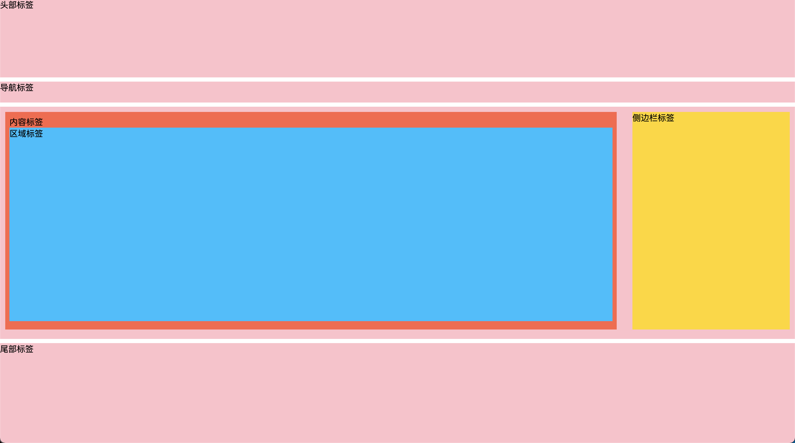

# 知识点：H5 新增语义化标签 和 布局方式

```html
<body>
    <header>头部标签</header>

    <nav>导航标签</nav>

    <div class="clearfix">
        <article>内容标签

            <section>区域标签</section>

        </article>

        <aside>侧边栏标签</aside>
    </div>

    <footer>尾部标签</footer>
</body>
```

**结构图：**


**作用：** 对 SEO 优化更加友好

**兼容性：** IE9+

**使用场景：** 更推荐移动端使用

## 一、头部标签 -->

```html
<header>头部标签</header>
```

## 二、导航标签

```html
<nav>导航标签</nav>
```

## 三、内容标签

```html
<article>内容标签</article>
```

## 四、区域标签

```html
<section>区域标签</section>
```

## 五、侧边栏标签

```html
<aside>侧边栏标签</aside>
```
        
## 六、尾部标签

```html
<footer>尾部标签</footer>
```