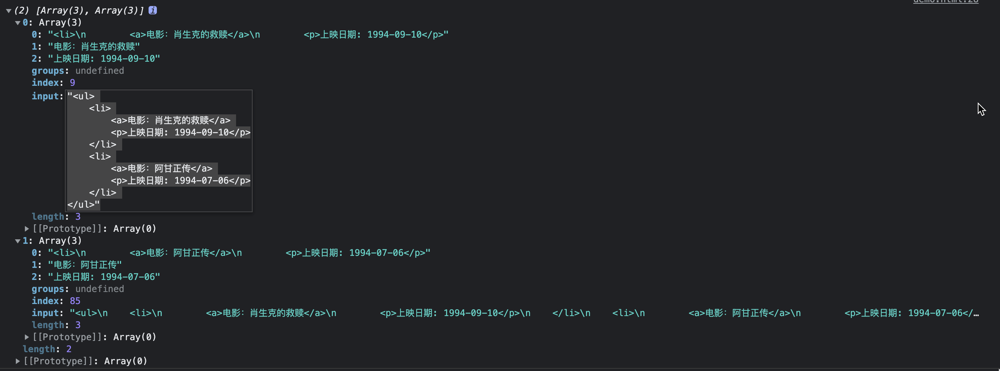

# 知识点：String 对象

- [知识点：String 对象](#知识点string-对象)
- [特性](#特性)
  - [字符串的值不可改变](#字符串的值不可改变)
  - [一、删除首尾空白字符](#一删除首尾空白字符)
  - [二、清除字符串 左侧 / 右侧 空白](#二清除字符串-左侧--右侧-空白)
  - [三、获取正则批量匹配的结果](#三获取正则批量匹配的结果)
  - [四、模板字符串](#四模板字符串)
    - [特性](#特性-1)
      - [1、允许解析变量](#1允许解析变量)
      - [2、允许换行](#2允许换行)
      - [3、允许调用函数](#3允许调用函数)
  - [五、查找指定字符是否在该字符的 头部](#五查找指定字符是否在该字符的-头部)
  - [六、查找指定字符是否在该字符的 尾部](#六查找指定字符是否在该字符的-尾部)
  - [七、将指定字符串重复 n 次](#七将指定字符串重复-n-次)
  - [八、字符串截取、数组截取](#八字符串截取数组截取)
  - [九、从前往后 查找第一个指定 字符索引 的位置](#九从前往后-查找第一个指定-字符索引-的位置)
  - [十、从后往前 查找第一个指定 字符索引 的位置](#十从后往前-查找第一个指定-字符索引-的位置)
  - [十一、返回指定索引的字符](#十一返回指定索引的字符)
  - [十二、返回指定索引的字符ASCII码](#十二返回指定索引的字符ascii码)
  - [十三、字符串、数组拼接](#十三字符串数组拼接)
  - [十四、截取字符](#十四截取字符)
  - [十五、替换字符](#十五替换字符)
  - [十六、字符串截取](#十六字符串截取)
  - [十七、字符串、数组 截取](#十七字符串数组-截取)
  - [十八、字符串转布尔值](#十八字符串转布尔值)

# 特性
## 字符串的值不可改变
```js
var str = 'abc'
str = 'hello'
```

1、虽然看上去改变了字符串的值，但其实是地址变了，原来的值依然存在于内存中
```js
var str = '';
for (var i = 0; i < 10000000; i++) {
  str += i;
}
console.log(str);
```

2、由于需要重复开辟内存空间，当重复创建大量字符串时，会影响性能

**特性：** 字符串所有的方法，都不会修改字符串本身（字符串的值不可改变），操作完成会返回一个新的字符串

## 一、删除首尾空白字符

**方法：** `字符串.trim()`

**返回值：** 新字符串


## 二、清除字符串 左侧 / 右侧 空白

**方法：** `trimStart / trimEnd`

**原数据：**
```js
let str = '   iloveyou   ';
```

**处理后：**
```js
str.trimStart();  // 'iloveyou   '
str.trimEnd();  // '   iloveyou'
```

## 三、获取正则批量匹配的结果

**方法：** `matchAll`

**需求：** 获取每个电影的 名称 和 上映事件

**原数据：**
```js
let str =
`<ul>
    <li>
        <a>电影：肖生克的救赎</a>
        <p>上映日期: 1994-09-10</p>
    </li>
    <li>
        <a>电影：阿甘正传</a>
        <p>上映日期: 1994-07-06</p>
    </li>
</ul>`;
```

**处理后：**
`console.log(arr)`


**使用步骤：**
```js
// （1）初始化正则
const reg = /<li>.*?<a>(.*?)<\/a>.*?<p>(.*?)<\/p>/sg

// （2）调用方法
const result = str.matchAll(reg);

// (3)方法一：
for(let v of result){
    console.log(v);
}

// (3)方法二（推荐）：
const arr = [...result];
console.log(arr);
```

## 四、模板字符串

**方法：** `let name = \`字符串`;`

### 特性

#### 1、允许解析变量
**方法：** `${变量名}`

```js
let name = '张三'
let sayHello1 = `hello,my name is ${name}`
console.log(sayHello1) // hello, my name is zhangsan
```

#### 2、允许换行
```js
let result = {
  name: 'zhangsan',
  age: 20,
  sex: '男'
}
let html = ` 
              <div>
                  <span>${result.name}</span>
                  <span>${result.age}</span>
                  <span>${result.sex}</span>
              </div> `
console.log(html)
```

#### 3、允许调用函数
**方法：** `${调用函数}`

```js
const sayHello2 = function () {
  return '哈哈哈'
}
let greet = `${sayHello2()}嘿嘿嘿`
console.log(greet) // 哈哈哈嘿嘿嘿
```

## 五、查找指定字符是否在该字符的 头部

**方法：** `字符串.startsWith()`

**返回值：** 布尔值（true：在；false：不在）

**原数据：**
```js
let str = 'Hello ECMAScript 2015'
```

**处理后：**
```js
let r1 = str.startsWith('Hello') // true
```

## 六、查找指定字符是否在该字符的 尾部

**方法：** `字符串.endsWith()`

**返回值：** 布尔值（true：在；false：不在）

**原数据：**
```js
let str = 'Hello ECMAScript 2015'
```

**处理后：**
```js
let r2 = str.endsWith('2016')  // false
```

## 七、将指定字符串重复 n 次

**方法：** `字符串.repeat(次数)`

**返回值：** 新字符串

```js
console.log('ha'.repeat(5)) // hahahahaha
```

## 八、字符串截取、数组截取

**作用：**
1. 一个参数：从指定索引往后截取，截取时包括指定索引
2. 两个参数：范围截取，截取时包括第一个参数的索引，但不包括第二个参数的索引

**方法：** `字符串.slice(索引)`

**返回值：** 新字符串/新数组

```js
let str = '123456'.slice(1) // 23456
let str1 = '123456'.slice(0, 3) // 123
let ary = [0, 1, 2, 3, 4].slice(1, 4) // [1,2,3]
```

## 九、从前往后 查找第一个指定 字符索引 的位置

`indexOf('要查找的字符','开始的位置')`

**特性：** 查找时包括开始的位置

**返回值：** 指定字符索引的位置；找不到返回 -1

```js
var str = '改革春风吹满地，春天来了'
str.indexOf('春')  // 2
str.indexOf('春', 3)  // 8
```

## 十、从后往前 查找第一个指定 字符索引 的位置

`lastIndexOf('要查找的字符','开始的位置')`

**特性：** 查找时包括开始的位置

**返回值：** 指定字符索引的位置；找不到返回 -1

```js
var str1 = '改革春风吹满地，春天来了'
str.lastIndexOf('春')  // 8
```

## 十一、返回指定索引的字符

`charAt(指定索引)`

**返回值：** 返回指定索引的字符；没有找到则返回空

```js
var str2 = 'andy'
str2.charAt(3)  // y
```

## 十二、返回指定索引的字符ASCII码

`charCodeAt(指定索引)`

**返回值：** 返回指定索引的字符ASCII码；没有找到则返回空

**使用场景：** 判断用户按下的是哪个按键

```js
var str3 = 'andy'
str3.charCodeAt(3)  // 121
```

## 十三、字符串、数组拼接

`concat(字符串, 字符串, ...)`

**返回值：** 新的字符串

```js
var str4 = 'pi'
var str5 = 'nk'
// pink
str4.concat(str5)
```

## 十四、截取字符
`substr(截取的起始位置，[截取几个字符])`

**特性：** 不写参数二，默认截取起始位置后面的所有字符

```js
var str6 = '改革春风吹满地'
str6.substr(2, 2)  // 春风
```

## 十五、替换字符
`replace('被替换的字符 或 正则表达式', '替换为的字符')`

**特性：** 只会替换第一个字符

**使用场景：** 替换敏感词

```js
var str7 = 'andyandy'
str7.replace('a', 'b')  // bndyandy
```

**正则表达式：**
```js
var text = document.querySelector('textarea')
var btn = document.querySelector('button')
var div = document.querySelector('div')
btn.onclick = function () {
  div.innerHTML = text.value.replace(/激情|gay/g, '**')
}
```

## 十六、字符串截取

`split('分隔符')`

**返回值：** 返回新数组

```js
var str8 = 'red, pink, blue'
str8.split(',') // ["red", " pink", " blue"]
```

## 十七、字符串、数组 截取
  **方法：** `数组/字符串.slice()`

  **参数一：** 从哪个索引开始截取，包括当前索引
  **参数二：** 截取到哪个索引，不包括当前索引

  **返回值：** 新字符串/新数组

  **例：**
  ```js
  let arr = [1500, 1200, 2000, 2100, 1800];
  let str = '12345';

  let newArr = this.arr.slice(0, 2)
  let newStr = this.str.slice(0, 2)
  console.log(newArr) // [1, 2]
  console.log(newStr) // '12'
  ```

## 十八、字符串转布尔值
  详见【!! 操作符】笔记