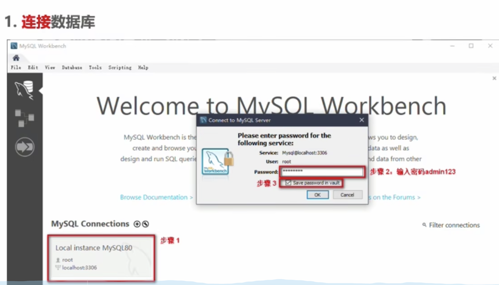
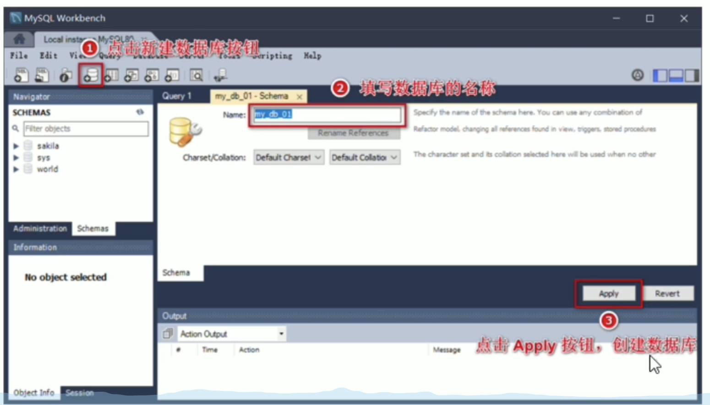
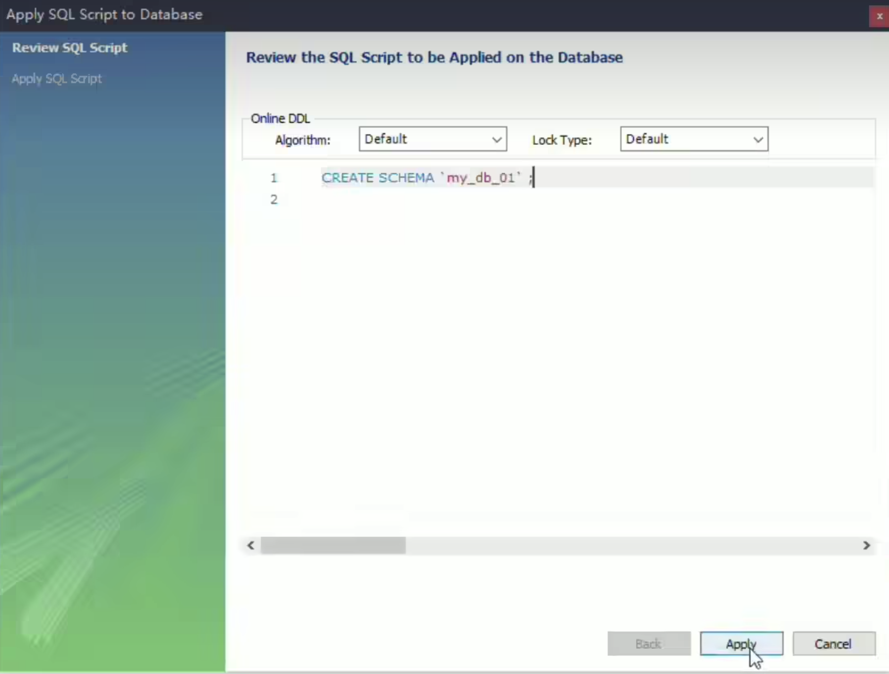
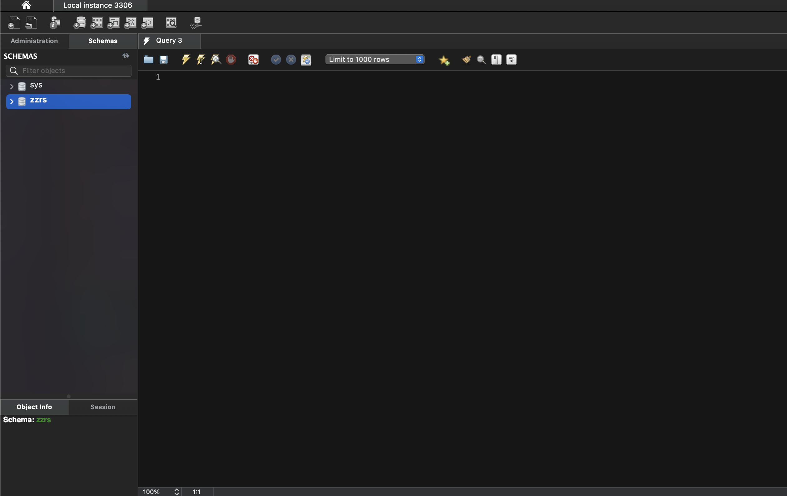
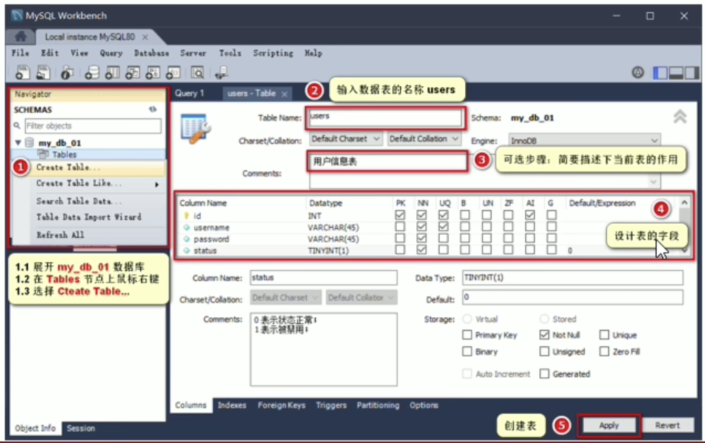
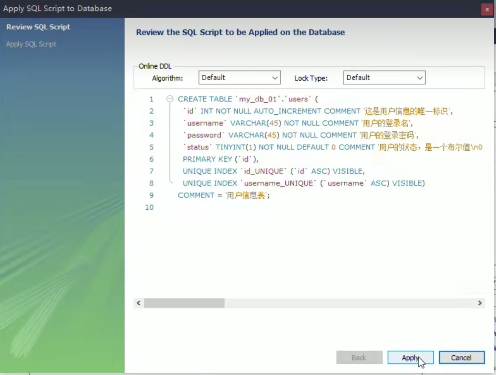
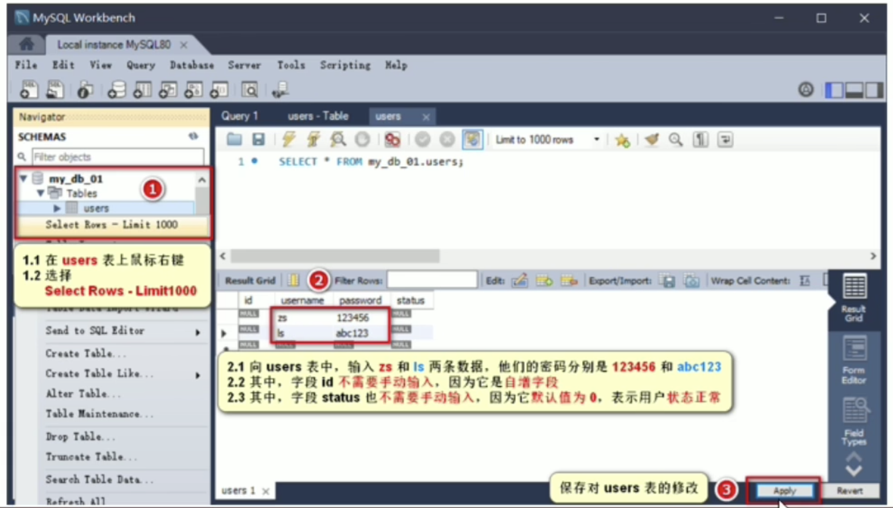
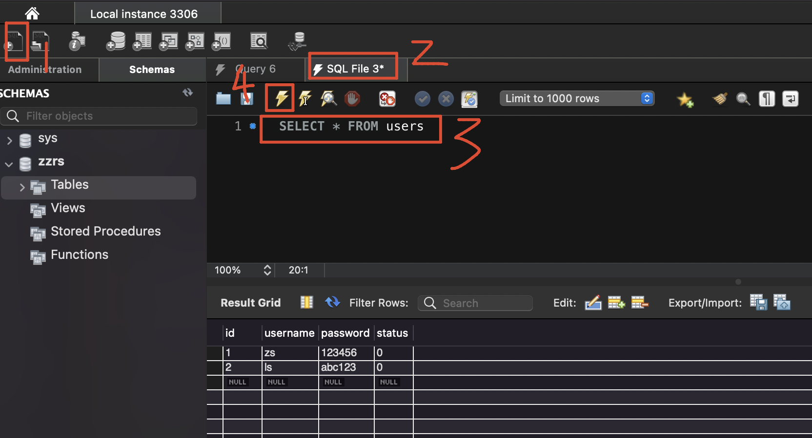

**作用：** 以图形化界面的方式操作数据库里面的数据

# 连接数据库
  

  ## 【BUG】没有显示默认的数据库
  **解决方式：** 在系统偏好设置中开启 MySQL

# 创建数据库
  

  

  ## 双击切换刚刚创建的数据库，数据库字体变粗代表切换成功
  

# 创建数据表 & 创建数据字段
  

  

  **DataType 数据类型：**
  1、INT：整数
  2、VARCHAR(最大长度) ：有上限字符串
  3、TEXT：没有上限的字符串
  4、TINYINT(0：true，1：false) ：布尔值

  **字段的特殊标识：**
  1、PK：主键。唯一标识
  2、NN：值不允许为空
  3、UQ：值唯一。不能有重复
  4、AI：值自动增长
  5、Default Expression：默认值

# 向表中写入数据
  

# 执行 SQL 语句
  