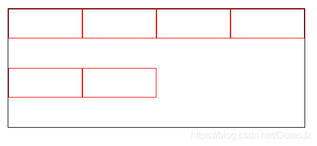

# 【BUG】二级菜单下拉时有顿挫感
  **原因：** overflow: hidden 导致的。因为父盒子的高是 0，所以文本是隐藏的，当父盒子的高 100% 时，文本就会蹦出来，导致了顿挫的感觉

  **解决方法：** 为父盒子添加 overflow: hidden，并写死子盒子的高度

# 轮播图功能
  ## 1、下载 swiper 插件
  `npm i swiper@^5.3.6 vue-awesome-swiper@4.1.1 --save`

  ## 2、导入文件
  ```js
  // 轮播图
  import { Swiper, SwiperSlide } from 'vue-awesome-swiper'
  import 'swiper/css/swiper.css'
  ```
    
  ## 3、注册组件
  ```js
  components: {
    Swiper,
    SwiperSlide
  },
  ```

  ## 4、导入结构
  ```html
  <!-- options：配置轮播项 -->
  <swiper :options="swiperOption">
    <!-- 轮播项 -->
    <swiper-slide v-for="(item, index) in swiperOption.focusList" :key="index">
      <a href="javascript:">
        
      </a>
    </swiper-slide>
    <!-- 分页器 -->
    <div class="swiper-pagination" slot="pagination"></div>
    <!-- 左箭头 -->
    <div class="swiper-button-prev" slot="button-prev"></div>
    <!-- 右箭头 -->
    <div class="swiper-button-next" slot="button-next"></div>
  </swiper>
  ```

  ## 5、配置
  ```js
  data() {
    return {
      swiperOption: { // 配置轮播图：
        focusList: [], // 轮播图列表
        autoplay: { // 自动播 放配置项
          disableOnInteraction: false // 用户拖动后不允许自动播放
        },
        loop: true, // 开启 循环播放
        cubeEffect: { // 动画 配置项
          shadowOffset: 100,
          shadowScale: 0.6,
        },
        pagination: { // 配置 分页器
          el: '.swiper-pagination', // 指定分页器的渲染位置
          clickable: true, // 允许 点击切换图片
        },
        
        navigation: { // 配置 button-prev 和 button-next 组件
          prevEl: '.swiper-button-prev', // 允许 点击切换到上一张图片
          nextEl: '.swiper-button-next', // 允许 点击切换到下一张图片
        },
      },
    }
  },
  ```

  ## 6、配置样式：
  ```scss
  .swiper-container {
    width: 100%;
    height: 100%;
    img {
      width: 100%;
      height: 100%;
    }
    // 左箭头、右箭头
    .swiper-button-prev,
    .swiper-button-next {
      color: #fff;
    }
  }
  // 分页器
  /deep/ .swiper-container-horizontal > .swiper-pagination-bullets .swiper-pagination-bullet {
    background: #fff;
  }
  ```

  ## 【BUG】第一次加载时显示的是最后一张图片
  **原因：** 因为数据的渲染是 

  **解决方法：** 轮播图列表加载完毕后再显示轮播图
  ```html
  <swiper v-if="swiperOption.focusList" :options="swiperOption">
  ```

# 【BUG】flex 布局，用了 flex-wrap: wrap; 自动换行属性后，导致两行 div 中间有空行
  **如图：**
  

  **解决方法：** 给外层父元素添加 `align-content: flex-start;`

# 图片懒加载
  详见【性能优化 → 图片懒加载】