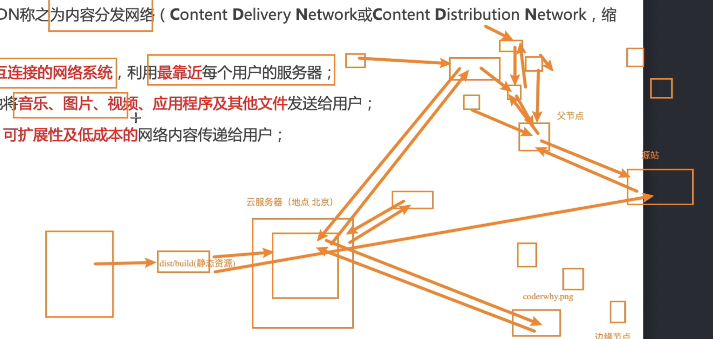

**概念：** CDN（内容分发网络）。使用最靠近用户的服务器，将资源发送给用户

**作用：** 性能优化
  1、减小项目体积

**CDN 分发的流程：**
  1、先将资源上传到 CDN 服务器
  2、用户下载资源
  3、先去最近的服务器（边缘节点）查找 
  4、如果没有资源缓存，再去父节点查找
  5、父节点没有缓存，再去源站进行查找
  6、源站将资源原路返回，并在返回的节点上留下缓存，最后响应给用户
  7、其它用户在下载资源的时候就可以从这个缓存中下载了

  