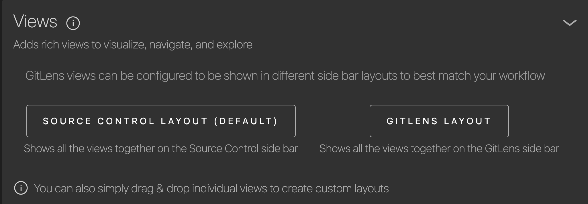
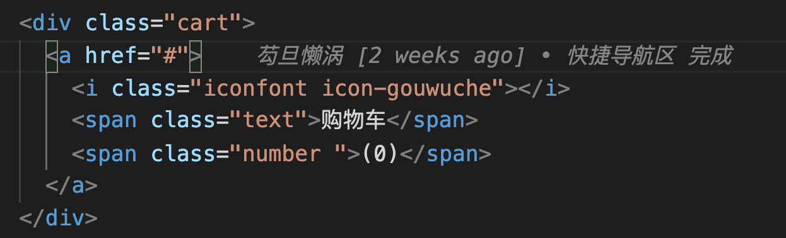
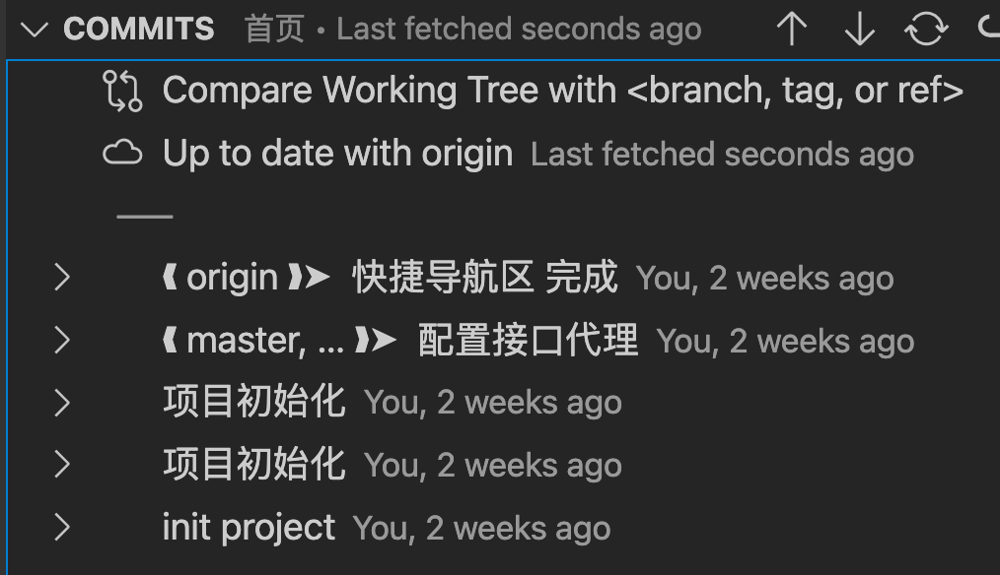

# 一、约束代码风格
  **插件：** ESLint（作者：Microsoft）
  **作用：**
  1、约束代码风格
  2、提示代码不规范的地方
  3、根据 ESLint 规则自动格式化

  **配置：**
  在 vscode 设置中搜索 Editor: Default Formatter，选择 ESLint

  1、制表符（Tab）
  **特性：** 代码缩进一般是两个空格，四个空格 会导致代码太宽
  **使用步骤：**
  1. 打开 VScode 编辑器中的 设置
  2. 搜索 tabsize 
  3. 将 Editror:Tab Size 改为 2
  4. 将 Vetur > Format > Options: Tab Size 改为 2

  2、保存格式化代码
  **使用步骤：**
  1. 打开 VScode 编辑器中的 设置
  2. 搜索 Format On Save，并打勾

  **主流规范：**
  - 代码结尾不能跟 分号
  - 声明的变量和方法必须被 调用
  - 代码的最后一行要加 换行
  - tab：两个空格
  - 方法名和括号之间要加 空格

  3、js 文件格式化不生效的问题
  **解决方法：** 右键格式化，跟着提示配置即可

  **常见规则：**
  ```
        规则名称	                        规则约束/默认约束
    quotes	                        默认：字符串需要使用单引号包裹
    key-spacing	                    默认：对象的属性和值之间，需要有一个空格分割
    comma-dangle	                默认：对象或数组的末尾，不允许出现多余的逗号
    no-multiple-empty-lines	        不允许出现多个空行
    no-trailing-spaces	            不允许在行尾出现多余的空格
    eol-last	                    默认：文件的末尾必须保留一个空行
    spaced-comment	                在注释中的//或/*后强制使用一致的间距
    indent	                        强制一致的缩进
    import/first	                import 导入模块的语句必须声明在文件的顶部
    1space-before-function-paren	方法的形参之前是否需要保留一个空格
    no-unused-vars                  声明的 变量/常量 没有被使用
  ```

  **.eslintrc.js 配置文件：**
  **规则文档：** https://eslint.bootcss.com/docs/rules/

  ```
  rulds: {
    / production：发布阶段 才会生效
  
        'no-console': process.env.NODE_ENV === 'production' ? 'warn' : 'off',  // 禁用 console

        // debugger
        // 作用：打断点，代码会在 debugger 出现的地方停止执行，方便调试
        // 解决：传统的浏览器打断点，当代码量很多时，还需要找打断点的地方，导致 效率低的问题
        /* 如：
            let name = 'zs'
            debugger
            name = 'ls'
            debugger
            console.log(name)
        */
        'no-debugger': process.env.NODE_ENV === 'production' ? 'warn' : 'off',  // 禁用 debugger

  }
  ```

  **配置规则（-- .eslintrc.js）**：

  **特性：**

  1、当代码风格不规范导致的报错，但不知道哪条规则报错，可以复制报错信息后面的 规则（灰色字体），到 规则文档中 搜索

  **例：** 4:1：第四行，第一个字符 报错
  **如：** 4:1 error More than 1 blank line not allowed no-multiple-empty-lines
  复制 no-multiple-empty-lines 到 规则文档中搜索，规则文档会告诉你 这是 禁止出现多行空行 的规则，
  在 Options 中有配置该规则的选项，根据文档进行修改

  ```
  rulds: {
    'no-console': process.env.NODE_ENV === 'production' ? 'warn' : 'off',  // 禁用 console
    'no-debugger': process.env.NODE_ENV === 'production' ? 'warn' : 'off',  // 禁用 debugger
    
    // ignore：忽略这条规则（即使代码风格不规范，也不会报错）
    "space-before-function-paren": ["error", "ignore"]

    // '规则': ['error', 'Options']
    'comma-dangle': ['error', 'always'], // 要求使用拖尾逗号

    'space-before-function-paren': 0, // 函数和圆括号之间没有空格
    'comma-dangle': ['error', 'never'], // 要求或禁止使用拖尾逗号
    'eol-last': ['error', 'always'] // 要求或禁止文件末尾保留一行空行
  }
  ```

# 二、保存时自动格式化化代码

**插件：** Prettier-Code formatter 插件（作者：Prettier）
    
**文档：** https://prettier.io/docs/en/options.html#quote-props

**文档：** https://www.jianshu.com/p/4be58a69b20f

**.prettierignore（忽略清单）**
    
## 插件配置

**使用步骤：**

1、选择 VScode 中的的设置 打开 settings.json 配置文件

2、在花括号里的 最上面 添加以下代码

```
// ESLint 插件配置
"editor.codeActionsOnSave": {
    "source.fixAll": true,
},
"eslint.alwaysShowStatus": true,

// prettier 插件配置
"prettier.configPath": "C:\\Users\\xxxx\\.prettierrc",  // .prettierrc 配置文件路径

// vetur 插件配置
"vetur.format.defaultFormatter.html": "js-beautify-html",
"vetur.ignoreProjectWarning": true,
"vetur.format.defaultFormatterOptions": {
    "js-beautify-html": {
        "wrap_attributes": false
    },
},
```

3、打开访达，command + shift + g，输入 ~

4、创建名为 .prettierrc 的文件，并进行配置（BUG：要在同一个 vscode 中配置才能生效，不要打开两个 vscode ，然后在另一个 vscode 中进行配置）

```
{
    "semi": false, // 代码末尾不加分号
    "printWidth": 300, // 每行文字个数超出此限制将会被迫换行
    "trailingComma": "es5", // 对象、数组末尾加逗号
    "singleQuote": true, // 使用单引号替换双引号
    "arrowParens": "avoid",  // always 总是有括号
    "quoteProps": "preserve"  // 保存时，不会自动将动态类名的引号去掉
}
```

5、将 "prettier.configPath": ".prettierrc 所在路径" 配置项放到 VScode 中的 settings.json 配置文件中
**如：** "prettier.configPath": "/Users/zhengcunrui/.prettierrc"    （该路径待验证，学习时自己想的）

6、随便打开 VScode 中的 js 文件，右键内容区，选择 格式化文档的方式，如果 prettierrc - Code formatter 不是默认值，点击 配置默认格式化程序，将 prettierrc - Code formatter 改为默认值

## 禁用规则

### 局部禁用规则

**说明：** 这条规则不会在该组件中生效

**使用步骤：** 在当前组件的 script 中添加以下代码

**语法：** /* eslint-disable 规则名称 */

**如：** /* eslint-disable space-before-function-paren */

### 全局禁用规则

**使用步骤：** 在 rules 字段中添加禁用规则代码（-- .eslintrc.js）

**如：**
```
rules: {
    // 禁用（off）
    'space-before-function-paren': 'off'
    // 禁用（0）
    'eqeqeq': 0,
}
```

# 三、Markdown 工具包
  **插件：** Markdown All in One（作者：Yu Zhang）

  **作用：**
  （1）Markdown 语法快捷键

  （2）代码自动补全

  （1）自动添加链接

  **使用步骤：** 选中要添加链接的文本，将赋值的链接粘贴即可
    
# 四、Markdown 工具包
  **语法：** Markdown Preview Enhanced（作者：Yiyi Wang）

  **作用：**
  （1）查看渲染后的 Markdown

  （2）将 Markdown 导出为 PDF
  **使用步骤：** 右键新的渲染层 → Chrome → PDF
    

# 五、快捷插入图片
  **插件：** Paste Image（作者：mushan）

  **作用:**
  （1）快捷插入图片，并在文件所在目录添加该图片，可配合截图工具使用
  **使用步骤：** cmd + option + v

  ## 修改图片存放路径
  **使用步骤:**
  1、设置中搜索 Paste Image: Path
  2、在 ${currentFileDir} 后面添加路径。如 ${currentFileDir}/images

# 六、驼峰翻译工具
  【关键词：转换大写、转换小写】

  **插件：** 驼峰翻译助手（作者：sven）

  **作用：** 中英文一键翻译转换成常用`大小驼峰`、`大小写` 等格式

  **使用步骤：** cmd + shift + t

# 七、GitLens（作者：GitKraken）

  ## 开启菜单栏图标
  （1）cmd + shift + p 输入：gitlens open settings

  （2）找到下图区域，选择 GITLENS LAYOUT
  

  ## （1）查看每行代码的日志
  **作用：** 对内置 git 功能进行了增强

  **说明：** 查看 `代码作者`、`代码时间`

  

  ## （2）查看提交历史信息
  

  也就是远程仓库中的仓库网络图：

# 八、快速生成 SASS/LESS
  **插件：** CSS Tree（作者：Sachin Bansal）

  **作用：** 保存时自动生成 SASS/LESS

  ## （一）快速生成 SASS/LESS
  1、选中生成的元素
  2、ctrl + p：Generate CSS tree

  ## （二）快速生成 CSS

# 九、Code Spell Checker（作者：Street Side Software）
  **作用：** 代码拼写检查器
  1、错误拼写代码提示
  2、自动修改错误拼写的代码
  3、错误拼写代码建议

# 十、图片预览
  **插件名：** Image preview（作者：Kiss Tamás）

# 十一、记录每次保存时的历史代码
  **插件名：** Local History（作者：xyz）
  
  **配置历史代码存放目录：**
  1、设置中搜索 Local-history:Path
  2、将目录设置为 /Users/zhengcunrui

# 十二、将 sass/less 转换成 css
  **插件名：** Easy Sass/Esay Less（作者：Wojciech Sura/mrcrowl）

  **使用方法：** 只在当前项目中使用。只推荐在小项目中开启。大项目不需要开启，因为 webpack 会自动转换
  右键插件 → 启用（工作区）

# 十三、代码片段
  **插件名：** Vue VSCode Snippets（作者：sarah.drasner）

# 十四、让 VScode 支持 vue 文件
  **插件名：** Vetur（Pine Wu）

  ## （一）自动 引入、注册 组件
  **提示：** 建议关闭。因为有时候会将代码放到错误的地方

  **说明：** 直接在 template 中使用组件即可，Vetur 会自动完成引入和注册

  **配置：** 将 Auto Import 打勾

# 十五、操作远程服务器
  在 VSCode 中安装 Remote-ssh（Microsoft）
  **说明：** 在 VSCode 中操作更方便

  ## 1、添加服务器
  1、点击 + 图标
  2、输入 ssh root@【云服务器公网 IP】
  3、选择更新配置文件：/Users/coderwhy/.ssh/config

  ## 2、连接服务器
  右键新增的服务器，点击 Connect to Host in New Window（在新窗口中打开）
  - 输入 root 用户的密码

  ## 3 Are you sure you want to continue connecting（是否继续连接服务器）
  Continue

  ## 4、编辑文件
  1、点击 新建文件图标
  2、点击 Open Folder
  3、选择一个要编辑的文件
  4、直接修改 ctrl + s 保存即可，和 VSCode 的使用习惯一样
  
  ## 5、说明：当前 VSCode 的终端就是远程服务器的终端

# 十六、注释增强
  **插件名：** koroFileHeader（作者：OBKoro1）

  **生成头部注释：** com + ctl + i

  **生成函数注释：** com + ctl + t

# 十七、volar
  **解决：** vetur 插件对 ts 支持不友好的问题

  **说明：** 是 vetur 的增强版，vetur 的功能它都有