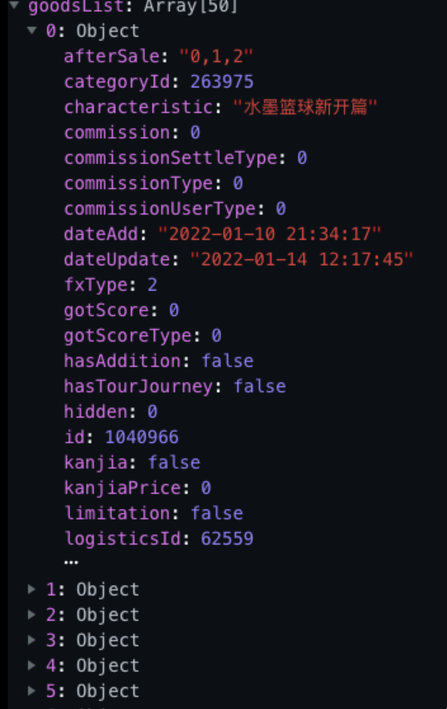
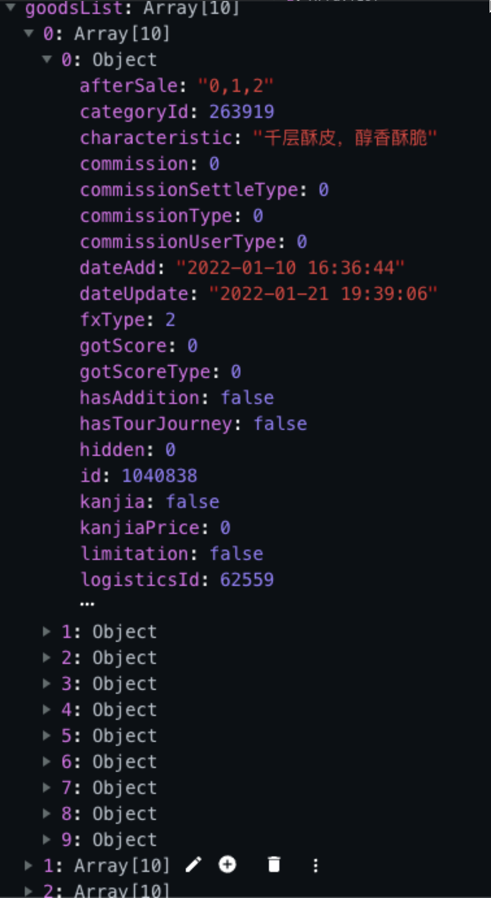

# 一、将 一维数组 格式化为 二维数组
**需求：** 将原数据转换为以每五个成员为一个数组的数组

**原数据：** 
```js
[{id: 1}, {id: 1}, {id: 1}, {id: 1}, {id: 1}, {id: 1}, {id: 1}, {id: 1}, {id: 1}, {id: 1}]
```

**新数据：**
```js
[
  [{id: 1}, {id: 1}, {id: 1}, {id: 1}, {id: 1}],
  [{id: 1}, {id: 1}, {id: 1}, {id: 1}, {id: 1}]
]
```

**原理：**
1. 使用 slice 方法截取数据
2. 再将返回的新数组 push 到新的变量中
3. 使用 for 循环重复以上步骤

**例：**
```js
async getFloorList() {
 const { data: res } = await uni.$http.get( '/banner/list', {
   type: 'fruit, drinks'
 } )
 
 let data = res.data
 let newData = []
 let j = 5
 for ( let i = 0; i < data.length; i += 5 ) {
   newData.push( data.slice( i, j ) )
   j += 5
 }

 if ( res.msg !== 'success' ) return uni.$showMsg()

 this.floorList = newData
}
```

# 二、筛选出数组中元素对象所拥有的某个属性值
   ## （一）筛选出元素对象 categoryId 为 '263919', '263920', ... 的属性，并且 this.goodsList 的每个元素长度不能超过 6
   **原数据：**
   

   **新数据：**
   

   ```js
   getGoodsList() {
     const categoryId = ['263919', '263920', '263921', '263923', '269499', '263924', '263925', '263926', '263927', '263975']
     this.axios
       .post('/shop/goods/list/v2', {
         categoryId: categoryId,
       })
       .then(res => {
         this.goodsList = categoryId.map(item => {
           return (res.result || []).filter(item1 => item1.categoryId == item).slice(0, 6)
         })
       })
   },
   ```
  
  ## （二）筛选出数组中元素对象所拥有的某个属性值
  ```js
  this.employeeList = result.rows.map(item => item.username)
  ```

# 三、将数组列表数据格式化成树形结构
  **如：**
  ```js
  // 格式化前
  [
    { id: 1, pid: '', text: '菜单1' },
    { id: 11, pid: 1, text: '菜单1-1' },
    { id: 12, pid: 1, text: '菜单1-2' },
    { id: 2, pid: '', text: '菜单2' },
    { id: 21, pid: 2, text: '菜单2-1' },
  ]
  
  // 格式化后
  [
    {
      id: 1, pid: '', text: '菜单1', children: [
        { id: 11, pid: 1, text: '菜单1-1' },
        { id: 12, pid: 1, text: '菜单1-2' },
      ]
    },
    {
      id: 2, pid: '', text: '菜单2', children: [
        { id: 21, pid: 2, text: '菜单2-1' },
      ]
    }
  ]
  ```

  **原理：** 递归算法
  
  （1） 定义方法（-- utils/dataConvert.js）
  ```js
  // 将数组数据转换成树形结构
  export function tranListToTreeData(list, rootValue) { // （参数一【Array】： 数据）（参数二【String】：根值。分别顶层节点的值）
    var arr = []
    list.forEach(item => {
      if (item.pid === rootValue) {
        const children = tranListToTreeData(list, item.id)
        if (children.length) {
          item.children = children
        }
        arr.push(item)
      }
    })
    return arr
  }
  ```

  （2）导入方法（-- 组件）
  ```js
  import { tranListToTreeData } from '@/utils/dataConvert.js'
  ```

  （2）调用方法（-- 同上）
  ```js
  this.departs = tranListToTreeData(result.depts, '')
  ```

## 替换属性名
  **如：**
  ```js
  // 转换前：
  [
    {
      姓名: 1,
      手机号: 2,
      工号: 3,
    },
  ]

  // 转换后：
  [
    {
      name: 1,
      mobile: 2,
    },
  ]
  ``` 
  ---------------------
  ```js
  success({ results }) {
    // 格式：【旧属性：新属性】
    const relations = {
      '姓名': 'timeOfEntry',
      '手机号': 'mobile',
      '工号': 'workNumber',
    }
    /* 数据格式化。替换属性名
    转换前：
    [
      {
        姓名: 1,
        手机号: 2,
        工号: 3,
      },
    ]
    转换后：
    [
      {
        name: 1,
        mobile: 2,
        workNumber: 3,
      },
    ]
    */
    var newArr = results.map(item => {
      var userInfo = {}
      Object.keys(item).forEach(key => {
        userInfo[relations[key]] = item[key]
      })
      return userInfo
    })

    // 调用接口批量添加用户
    await importEmployee(newArr)
    this.$message.success('导入 excel 成功')
    this.$router.back()
  }
  ```

# 四、将数组中对象类型的成员格式化成数组类型的成员 && 筛选出指定的属性 && 成员中的数据按照规定的顺序排列 && 去掉成员中的数据 key 只保留
  **数据转换前后对比：**
  ```js
  // 格式化前
  data: [
    {username: '张三', mobile: 123456, age: 18, demo: 1},
    {username: '李四', mobile: 123456, age: 18, demo: 1},
    {username: '王五', mobile: 123456, age: 18, demo: 1},
  ]

  // 格式化后
  newData: [
    ['张三', 18, 123456],
    ['李四', 18, 123456],
    ['王五', 18, 123456],
  ]
  ```

  **实现步骤：**
  ```js
  const order = ['username', 'age', 'mobile']
  // 格式化数据：将数组中对象类型的成员格式化成数组类型的成员 && 筛选出指定的属性 && 成员中的数据按照规定的顺序排列 && 去掉成员中的数据 key 只保留 value
  const newData = data.map(item => Object.keys(order).map(key => item[order[key]]))
  ```

# 五、格式化时间
  **科普：** `2018-11-02T08:00:00.000+0000` 时间格式也被称为 UTC 格式

  ## （一）使用 dayjs 库
  **作用：** 格式化时间 和 日期

  **文档：** `https://dayjs.gitee.io/docs/zh-CN/parse/string-format#%E6%94%AF%E6%8C%81%E7%9A%84%E8%A7%A3%E6%9E%90%E5%8D%A0%E4%BD%8D%E7%AC%A6%E5%88%97%E8%A1%A8`

  ## （1）基础用法
  **下载：** `npm install dayjs --save`

  ### 1、导入 dayjs
  ```js
  import dayjs from 'dayjs'
  ```

  ### 2、使用
  ```html
  <div>{{dayjs('2018-11-02T08:00:00.000+0000').format('YYYY-MM-DD HH:mm:ss')}}</div>
  ```

  ## （2）挂载到全局上（推荐）
  ### 1、将属性和方法挂载到全局上
  -- @/utils/globalProperties.ts
  ```ts
  import {App} from 'vue'
  
  -- 增
  import dayjs from 'dayjs'
  --

  export default function registerProperties(app: App) {

    -- 增
    app.config.globalProperties.$dayjs = dayjs
    --
    
  }
  ```

  ### 2、使用
  ```html
  <div>{{$dayjs('2018-11-02T08:00:00.000+0000').format('YYYY-MM-DD HH:mm:ss')}}</div>
  ```


  ## （二）使用老师提供的库
  ```js
  // 格式化前
  data: 2018-11-02T08:00:00.000+0000
  
  // 格式化后
  newData: 2018-11
  ```

  （1）导入方法（-- filters 文件由老师提供）
  ```js
  import { formatDate } from '@/filters'
  ```

  （2）调用方法
  ```js
  const newData = formatDate(data)
  ```

  ## （三）自定义
  ```js
  // 格式化前：
  43535

  // 格式化后：
  2019-09-09T16:00:00.000Z
  ```

  （1）将以下方法复制到 methods 中（-- @/view/import/index.vue; methods 配置项）
  ```js
  /* 格式化 excel 的日期
  格式化前：
    43535

  格式化后：
    2019-03-10
  */
  formatDate(numb, format) {
    const time = new Date((numb - 1) * 24 * 3600000 + 1)
    time.setYear(time.getFullYear() - 70)
    const year = time.getFullYear() + ''
    const month = time.getMonth() + 1 + ''
    const date = time.getDate() - 1 + ''
    if (format && format.length === 1) {
      return year + format + month + format + date
    }
    return year + (month < 10 ? '0' + month : month) + (date < 10 ? '0' + date : date)
  }
  ```

  （2）调用 formatDate 方法（-- 同上）
  ```js
  -- 换（旧）
  Object.keys(item).forEach(key => {
    userInfo[relations[key]] = item[key]
  })
  --

  -- 换（新）
  Object.keys(item).forEach(key => {
    if (relations[key] === 'timeOfEntry' || relations[key] === 'correctionTime') {
      userInfo[relations[key]] = new Date(this.formatDate(item[key], '/'))
    } else {
      userInfo[relations[key]] = item[key]
    }
  })
  --
  ```

# 六、通过枚举数据格式化字段数据
  **使用场景：** 该字段响应的数据为 1，需要把这个 1 变为特定的格式，如字段值为 1，则格式化为 正式

  （1）定义枚举数据（枚举数据：字段的值根据枚举数据进行变化）（-- @/api/新建 constant/employees.js）
  **枚举数据：**
  ```js
  export default {
    // 聘用形式
    hireType: [
      {
        id: 1,
        value: '正式'
      },
      {
        id: 2,
        value: '非正式'
      }
    ],
    // 在职状态
    workingState: [
      {
        id: '1',
        value: '在职'
      },
      {
        id: '2',
        value: '离职'
      }
    ],
  }
  ```

  （2）导入枚举数据（-- 组件）
  ```js
  import EmployeeEnum from '@/api/constant/employees'
  ```

  （4）定义格式化方法（-- 同上）
  ```js
  ！！！以下代码需要进行完善，使其看起来更加清晰、简单

  // 格式化 聘用字段的数据
  if (order[key] === 'formOfEmployment') {
    const obj = EmployeeEnum.hireType.find(obj => obj.id === item[order[key]])
    return obj ? obj.value : '未知'
  }
  ```

# 修改数组中元素对象的属性名
  **如：**
  ```js
  // 转换前：
  [
    {
      姓名: 1,
      手机号: 2,
      工号: 3,
    },
  ]

  // 转换后：
  [
    {
      name: 1,
      mobile: 2,
    },
  ]
  ``` 
  ---------------------
  ```js
  success({ header, results }) { // 上传文件成功后触发
    // header：字段 【type：Array】
    // results：字段数据 【type：Array】

    -- 增
    // 格式：【旧属性：新属性】
    const relations = {
      '姓名': 'username',
      '手机号': 'mobile',
      '工号': 'workNumber',
    }
    /* 数据格式化。替换属性名
    转换前：
    [
      {
        姓名: 1,
        手机号: 2,
        工号: 3,
      },
    ]
    转换后：
    [
      {
        name: 1,
        mobile: 2,
        workNumber: 3,
      },
    ]
    */
    var newArr = results.map(item => {
      var userInfo = {}
      Object.keys(item).forEach(key => {
        userInfo[relations[key]] = item[key]
      })
      return userInfo
    })

    // 调用接口批量添加用户
    await importEmployee(newArr)

    this.$message.success('导入 excel 成功')
    this.$router.back()
    --
  }
  ```
