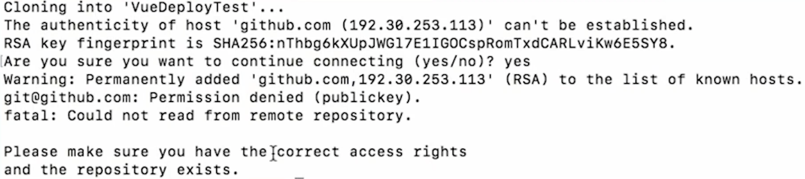

**科普：** 更推荐使用阿里云，服务好，也是最早最服务器的

**说明：** 
  1、该流程由 运维 部署
  2、以下操作已腾讯云为例

**轻量应用服务器 文档：** `https://cloud.tencent.com/document/product/1207`

**参考 视频：** `https://www.bilibili.com/video/BV1ZT4y1c7iL?p=12`

**视频：** `https://www.bilibili.com/video/BV1334y1U7Wz?spm_id_from=333.337.search-card.all.click`

**平台：** 腾讯云

**服务器配置：**
- **类型：** 2 核 4G 轻量级服务器
- **宽带：** 6M
- **系统盘：** 60GB SSD盘
- **月流量：** 1000GB

# 镜像
  应用镜像：适合不会 Linux 操作系统的用户
  系统镜像：CentOS 8.2 64 位
  - 8 之前的版本使用的 yum 包管理根据、8 之后的版本新增 dnf 包管理根据。更推荐使用 dnf，8 之前的版本可以使用 yum 下载 dnf，如 yum install dnf -g
  - 查看是否安装 dnf。直接输入 dnf 如果有命令提示代表已安装

# 域名实名认证（满 72 小时后才可备案）

# 备案
  **科普：** 使用中国大陆境内服务器开办网站，必须完成 ICP 备案，并取得工信部备案号

  **时长：** 20 个工作日内。（我只用了 3 天）
    - 服务器平台（腾讯云）将会在 1 个工作日左右将您的备案订单上报至通信管理局。（腾讯客服会打电话向你核实信息。然后在打电话向你的紧急联系人核对信息）
    - 通信管理局将在 20 个工作日内完成审核

  **请做好以下准备：**
  1、注册域名

  2、购买服务器

# 公安备案
  **说明：** 网站需要在备案通过后的 30 天内进行公安备案

  **具体操作流程 和 填写信息：** https://cloud.tencent.com/document/product/243/19142

# 解析域名（耗时 2 分钟内）
  1、主机记录选择 www
  2、记录值为远程服务器 ip

# 重置 root 密码

# 自动化部署
  详见【自动化部署】笔记

# 添加用户，并给予这个用户管理员的权限
  ## 1、重置远程服务器密码

  ## 1、添加用户
  `sudo adduser zcr`
  - 创建密码
  - 确认密码
  - 信息默认不填
  - Y

  ## 2、打开 sudoers 文件
  `sudo vim /etc/sudoers`
  
  ## 3、给予用户管理员权限
  ```js
  Defaults        env_reset
  Defaults        mail_badpass
  Defaults        secure_path="/usr/local/sbin:/usr/local/bin:/usr/sbin:/usr/bin:/sbin:/bin:/snap/bin"

  root    ALL=(ALL:ALL) ALL

  %admin ALL=(ALL) ALL

  %sudo   ALL=(ALL:ALL) ALL
  -- 增
    zcr ALL=(ALL:ALL) ALL
  --

  lighthouse ALL=(ALL) NOPASSWD: ALL
  ubuntu  ALL=(ALL:ALL) NOPASSWD: ALL
  ```

  - 强制报错：W!
  - 退出：q

  ## 4、退出远程服务器
  `exit`

  ## 5、以后使用刚刚创建的 zcr 用户进行连接即可
  `ssh zcr@124.221.216.72`

# 配置 SSH（没配置成功，先跳过这一步吧）
  **作用：** 以后登录远程服务器就不需要输入密码了

  ## （1）创建密钥（-- 腾讯云/控制台/轻量应用服务器/密钥）
  **说明：** 创建完毕会自动下载一个密钥，要保存好，一会要上传到远程服务器

  ## （2）绑定实例
  绑定远程服务器

  ## （3）将密钥上传到远程服务器
  **说明：** 这个命令不需要登录 远程服务器，直接在终端输入即可

  `ssh-copy-id -i ~/.ssh/密钥名称 用户@远程服务器ip`

  **例：** `ssh-copy-id -i ~/.ssh/tenXunYunQinqLiangFuWuQi.pub zcr@124.221.216.72`


  **文档（以 mac 系统为例）：**
  1、Ubuntu 系统如何使用 root 用户登录实例？`https://cloud.tencent.com/document/product/1207/44569`
  2、管理密钥 `https://cloud.tencent.com/document/product/1207/44573`
  2、使用 SSH 登录 Linux 实例 / 使用密钥登录 `https://cloud.tencent.com/document/product/1207/44643`

# 升级 apt-get 包管理工具
  ## 1、登录远程服务器
  
  ## 2、升级 apt-get 包管理工具
  `sudo apt-get update`

# 在远程服务器中 配置环境、安装包
  ## 1、安装 nginx（轻量级 web 服务器）
  `sudo apt-get install nginx`

  ## 2、安装 nodejs 环境
  `sudo apt-get install nodejs`

  **说明：** 安装的版本比较低，如果是版本 10 的需要手动升级，目前稳定版是版本 16

  **查看版本：** node --version

  **升级到最新版：** 因为 nodejs 不能自升级到最新版，所以需要借助 n 这个库
  1. **下载 n 包：** sudo npm i -g n
  2. **升级 node 至最新的稳定版：** sudo n stable

  ## 3、安装 npm
  `sudo apt-get install npm`

  **说明：** 版本如果是 6 的需要手动升级，目前稳定版是版本 8

  **查看版本：** npm --version

  **升级到最新版：** sudo npm i -g npm@latest

  ## 4、切换 npm 下载资源的镜像地址
  **下载：** `sudo npm i nrm -g`

  **查看镜像地址：** `nrm ls`

  **切换为淘宝的镜像：** `nrm use taobao`

  ## 5、测试
  浏览器输入服务器 ip 或 域名，如果显示 Welcome to nginx! 代表配置成功

# 将远程仓库中的项目部署到远程服务器中
  ## 1、进入到该目录下
  `cd /var/www/html`

  ## 2、克隆远程仓库到该目录中
  `sudo git clone <远程仓库中的 HTTPS>`
  
  - 输入 gitee 账号
  - 输入 gitee 密码

  ### BUG：远程仓库 和 远程服务器没有建立连接
  

  **解决方法：** 将服务器的 SSH 公钥添加到远程仓库中

  1、返回远程服务器根目录
  2、进入到 .ssh 目录目录中：cd .ssh
  3、创建公钥和密钥：ssh-keygen
  4、查看公钥，并复制内容：car id_rsa.pub
  5、进入到远程仓库中 → 管理 → 部署公钥管理 → 添加公钥 → 设置标题 → 将公钥粘贴到内容中 → 添加
  6、进入到 vue 目录下：/var/www/html/vue/
  7、git clone <远程仓库中的 HTTPS>

  ## 4、进入到项目中
  `cd <项目名称>`
  
  **例：** `cd my-zhengzhengrishang-pc/`

  ## 5、安装依赖
  `sudo npm i`

  ### BUG：报很多 npm ERR 的错，而且也没有出现 node_modules 这个目录
  **解决方法：** 重新安装本机在使用的 npm 版本
  `sudo npm i -g npm@6.14.13`


  ## 6、打包项目
  **说明：** 这里如果打包不成功可以现在本地打包在上传

  `sudo npm run build`

# 配置访问某个地址时，指定渲染的 index.html
  ## 1、打开 default 文件
  `sudo vim /etc/nginx/sites-available/default`

  ## 2、修改配置
  ```js
  -- 改（旧）
  root /var/www/html;
  --

  -- 改（新）
  root /var/www/html/项目目录/dist 
  --
  ```

  ## 3、检查语法（可以用来查看 nginx 的配置文件所在位置）
  `sudo nginx -t`

  **说明：** 显示 syntax is ok、successful 这些单词代表成功

  ## 4、重启 nginx
  `sudo nginx -s reload`

# 开启 https
  **文档：** `https://cloud.tencent.com/document/product/400/35244`

  ## （1）申请免费证书
  -- 腾讯云/控制台/搜索 ssl/选择 ssl 证书/我的证书
  **说明：** 跟着推荐选，只填必填的就可以了

  ## （2）下载证书
  -- 同上
  下载 Nginx

  ## （3）上传证书文件到远程服务器并修改 nginx 配置文件
  ### 1、打开 FinalShell 软件

  ### 2、点击目录图标

  ### 3、点击菜单栏第一个图标

  ### 4、点击 SSH 连接(Linux)

  ### 5、推荐连接远程服务器的信息
  - 名称：自定义
  - 主机：远程服务器官网 IP
  - 端口：22
  - 认证方法：公钥
  - 用户名：远程服务器用户名
  - 私钥：在配置 SSH 时下载的私钥

  ### 6、点击连接

  ### 7、进入到远程服务器目录中
  `cd /`

  ### 8、创建 ssl 目录
  `sduo mkdir ssl`

  ### 9、进入到 sll 目录中
  `cd ssl`

  ### 10、上传证书 秘钥、文件
  `sudo rz`

  ### 11、打开 nginx 配置文件
  **提示：** default 文件最好备份一下，如果配置不成功方便改回来

  `/etc/nginx/nginx.conf` || `sudo vim /etc/nginx/sites-available/default`

  ### 12、修改 nginx 配置文件
  **科普：** Nginx 可以配置多个服务器，一个Server就是一个服务器

  ```
  -- 增
  server {
    # SSL 访问端口号为 443
    listen 443 ssl;

    # 绑定证书的域名
    server_name zhengzhengrishang.cc;

    # 证书文件所在路径
    ssl_certificate /ssl/zhengzhengrishang.cc_bundle.crt;

    # 私钥文件所在路径
    ssl_certificate_key /ssl/zhengzhengrishang.cc.key;

    # 代理配置
    location / {
      # 网站默认打开文件所在目录
      root /var/www/html/demo;

      # 网站默认打开文件名称
      index index.html index.htm;
    }
  }
  --
  
  server {
    listen 80 default_server;
    listen [::]:80 default_server;

    root /var/www/html/demo;

    index index.html index.html index.nginx-debian.html;

    server_name _;

    location / {
            try_files $uri $uri/ =404;
    }

    -- 增
    # 永久重定向
    return 301 https://www.$host$request_uri;
    --
  }
  ```

  ### 13、检测语法
  `sudo nginx -t`

  ### 14、重启 nginx
  `sudo nginx -s reload`

  ### 15、测试
  访问 http 跳转到 https 代表成功

# 配置 生产 环境下的接口代理（-- sudo vim /etc/nginx/sites-available/default）
  ```
  server {
    ...

    # 拦截携带 / 的接口
    location / {
      # 网站默认打开文件所在目录
      root /var/www/html/demo;

      # 网站默认打开文件名称
      index index.html index.htm;
    }

    -- 增
    # 拦截携带 /api 的接口
    location /api {
      # 代理到的目标地址
      proxy_pass https://api.it120.cc/zcr;
    }
    --
  }
  ```